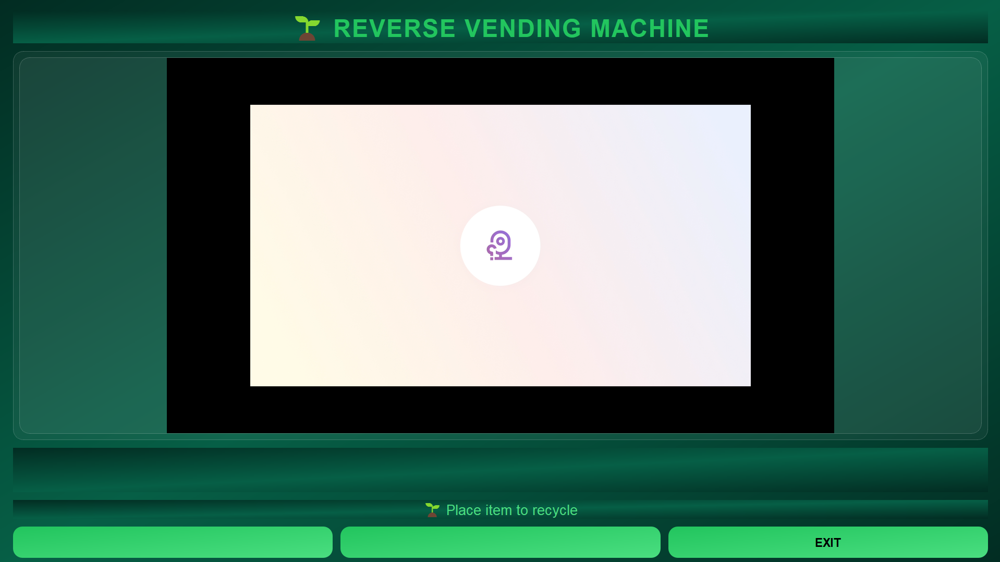

# 🌱 AI Reverse Vending Machine

> An AI-powered Reverse Vending Machine that detects recyclable objects using computer vision and rewards users with eco-points and coupon codes. Built using Python, RT-DETR, OpenCV, and PyQt5.

<p align="center">
  
</p>

---

## 📖 Overview

The **AI Reverse Vending Machine** is a smart recycling solution that encourages sustainable waste management through artificial intelligence.

The system uses a laptop camera to detect recyclable objects in real time. Once an object is identified, the user can confirm the detection, earn reward points, and receive a coupon code generated inside a colorful digital receipt.

This project demonstrates the integration of **Computer Vision, Artificial Intelligence, GUI Development, and Reward-Based Sustainability** into a single application.

---

# ✨ Features

- ♻️ Real-time recyclable object detection
- 🤖 RT-DETR AI object detection model
- 📷 Live camera interface
- 🎯 Confidence-based object recognition
- 💰 Eco reward points system
- 🎟 Automatic coupon code generation
- 📄 PDF receipt generation
- 🔊 Sound effects
- 🖥 Modern PyQt5 desktop interface
- 🌿 Environment-inspired UI
- 📱 Ready for future mobile integration

---

# 🧠 How It Works

```text
User
   │
   ▼
Places Recyclable Item
   │
   ▼
Laptop Camera
   │
   ▼
RT-DETR AI Model
   │
   ▼
Object Detection
   │
   ▼
User Confirmation
   │
   ▼
Reward Points
   │
   ▼
Coupon Generation
   │
   ▼
Colorful PDF Receipt
```

---

# 🏗 Project Architecture

```text
                +----------------+
                | Laptop Camera  |
                +--------+-------+
                         |
                         |
                 OpenCV Video Stream
                         |
                         ▼
              +---------------------+
              | RT-DETR AI Model    |
              +---------------------+
                         |
                 Detected Object
                         |
                         ▼
             +----------------------+
             | PyQt5 User Interface |
             +----------------------+
               |               |
               |               |
      Reward Points       Receipt Generator
               |               |
               +-------+-------+
                       |
                Coupon Generator
                       |
                       ▼
                 PDF Receipt
```

---

# 🧠 AI Model

This project uses **RT-DETR (Real-Time Detection Transformer)** through the Ultralytics framework.

### Why RT-DETR?

- Transformer-based architecture
- High detection accuracy
- Real-time inference
- End-to-end object detection
- No Non-Maximum Suppression (NMS)
- Better understanding of complex scenes

Detected recyclable objects include:

- Plastic Bottle
- Cup
- Can
- Paper
- Pen
- (Additional recyclable objects can easily be added)

---

# 🛠 Technologies Used

| Technology | Purpose |
|------------|---------|
| Python | Programming Language |
| RT-DETR | AI Object Detection |
| Ultralytics | Model Framework |
| OpenCV | Camera Processing |
| PyQt5 | Desktop GUI |
| ReportLab | PDF Receipt Generation |
| NumPy | Image Processing |

---

# 📂 Project Structure

```text
reverse-vending-machine-ai/

│
├── main.py
├── requirements.txt
├── README.md
├── LICENSE
│
├── model/
│   └── rtdetr-l.pt
│
├── assets/
│   ├── click.wav
│   ├── success.wav
│
├── receipts/
│
├── screenshots/
│   ├── home.png
│   ├── detection.png
│   ├── receipt.png
│
└── docs/
```

---

# 🚀 Installation

Clone the repository

```bash
git clone https://github.com/YOUR_USERNAME/reverse-vending-machine-ai.git
```

Go inside the folder

```bash
cd reverse-vending-machine-ai
```

Install dependencies

```bash
pip install -r requirements.txt
```

Run the application

```bash
python main.py
```

---

# 📸 Screenshots

### Home Screen



---

### Object Detection


---

### Receipt


---

# 🎯 Future Improvements

- 📱 Android Application
- ☁ Cloud Database
- 🔑 User Authentication
- 📍 Nearby Reverse Vending Machine Locator
- 🏆 Leaderboard
- 🌍 Carbon Footprint Calculator
- 🎁 Partner Brand Coupon Integration
- 📊 Analytics Dashboard

---

# 🌍 Environmental Impact

This project promotes sustainable waste management by encouraging users to recycle through an incentive-based reward system.

Benefits include:

- Reduced plastic waste
- Increased recycling awareness
- Circular economy support
- Eco-friendly reward mechanism

---

# 🎓 Academic Purpose

This project was developed as a **Final Year Engineering Project** to demonstrate the practical implementation of:

- Artificial Intelligence
- Computer Vision
- Sustainable Technology
- Human-Computer Interaction
- Reward-Based Recycling Systems

---

# 🤝 Contributing

Contributions are welcome.

1. Fork the repository
2. Create a new branch

```bash
git checkout -b feature-name
```

3. Commit your changes

```bash
git commit -m "Added new feature"
```

4. Push to GitHub

```bash
git push origin feature-name
```

5. Create a Pull Request

---

# 📜 License

This project is licensed under the MIT License.

---

# 👨‍💻 Author

**aadarsh-shrivas**

Final Year Engineering Student

Specialization:
- Artificial Intelligence
- Computer Vision
- UI/UX Design
- Python Development

---

# ⭐ If you like this project

Please consider giving it a ⭐ on GitHub!

It helps support the project and encourages future development.

---

<p align="center">
Made with ❤️ for a greener and smarter future 🌱
</p>
